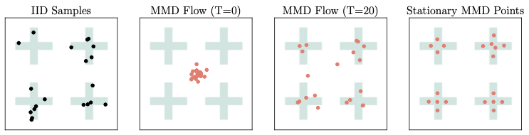

# Stationary MMD Points for Cubature

This repository contains the implementation of the code for the paper "Stationary MMD Points"[https://arxiv.org/abs/2505.20754]. See below for an illustration of stationary MMD points.



## Installation

To install the required packages, run the following command:
```
pip install -r requirements.txt
```

## How to reproduce results

### 1. Mixture of Gaussian (MoG)

To reproduce the results for our proposed stationary MMD points in the MoG experiment (Figure 3 (Top row)), run the following command:

`python main.py --seed 0 --particle_num 100 --dataset mog --step_size 1.0 --bandwidth 1.0 --inject_noise_scale 0.0 --step_num 10000`

You can vary the number of particles $n$ by altering the argument '--particle_num 100'. The baseline methods: Support Points (SP), Kernel Herding (KH), Kernel Thinning (KT), Compress-KT++ (KT+), and Quasi-Monte Carlo (QMC) can also be run by replacing `main.py` with the corresponding Python script for each method. The number of particles $n$ for kernel thinning must be a power of 2. Detailed configurations and example scripts for all methods are provided in the `scripts/` directory.

### 2. OpenML Dataset

To reproduce the results for the openML dataset (Figure 3 (Bottom row)), run:

`python main.py --seed 0 --particle_num 100 --dataset elevators --step_size 0.3 --bandwidth 1.0 --inject_noise_scale 1.0 --step_num 100000`

`python main.py --seed 0 --particle_num 100 --dataset house_8L --step_size 1.0 --bandwidth 1.0 --inject_noise_scale 1.0 --step_num 100000`

You can vary the number of particles $n$ by altering the argument '--particle_num 100'. 
The baseline methods: Support Points (SP), Kernel Herding (KH), and Kernel Thinning (KT) can also be run by replacing `main.py` with the corresponding Python script for each method.
The number of particles $n$ for kernel thinning must be a power of 2. 
Detailed configurations and example scripts for all methods are provided in the `scripts/` directory. 